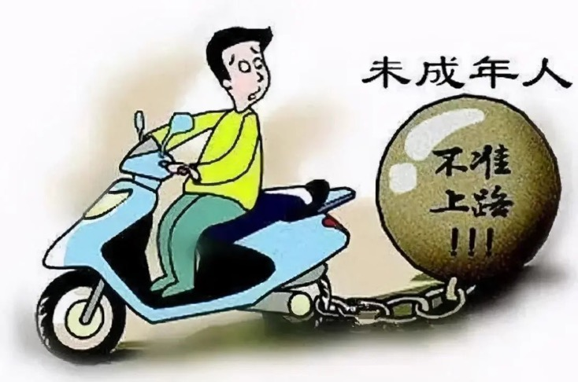

<!--  -->

# 自由平等的真谛`学习素材包`

<!-- >>本仓库收录XXXX -->

## 目录索引
- [自由平等的真谛`学习素材包`](#自由平等的真谛学习素材包)
  - [目录索引](#目录索引)
  - [法律依据](#法律依据)
  - [案例素材](#案例素材)
  - [座谈会素材](#座谈会素材)
    - [律师素材](#律师素材)
      - [给律师](#给律师)
    - [警察素材](#警察素材)
      - [给交通警察](#给交通警察)

## 法律依据

**《中华人民共和国民法典》**

**第一千零一十四条**	任何组织或者个人不得以干涉、盗用、假冒等方式侵害他人的姓名权或者名称权。

**第一千零一十七条**	具有一定社会知名度，被他人使用足以造成公众混淆的笔名、艺名、网名、译名、字号、姓名和名称的简称等，参照适用姓名权和名称权保护的有关规定。

**《互联网用户账号信息管理规定》**

**第八条**	互联网用户注册、使用账号信息，不得有下列情形：

（一）违反《网络信息内容生态治理规定》第六条、第七条规定；

（二）假冒、仿冒、捏造政党、党政军机关、企事业单位、人民团体和社会组织的名称、标识等；

（三）假冒、仿冒、捏造国家（地区）、国际组织的名称、标识等；

（四）假冒、仿冒、捏造新闻网站、报刊社、广播电视机构、通讯社等新闻媒体的名称、标识等，或者擅自使用“新闻”、“报道”等具有新闻属性的名称、标识等；

**《中华人民共和国未成年人保护法》**

**第五十八条**	营业性歌舞娱乐场所、酒吧、互联网上网服务营业场所等不适宜未成年人活动场所的经营者，不得允许未成年人进入。

**第十七条**	未成年人的父母或者其他监护人不得实施下列行为:……（七）放任未成年人进入营业性娱乐场所、酒吧、互联网上网服务营业场所等不适宜未成年人活动的场所；

**《中华人民共和国渔业法》**

**第三条** 中华人民共和国公民在中华人民共和国领域内的自由水域从事养殖或者捕捞水生动物和其它水生植物的权益受法律保护。

**《中华人民共和国体育法》**

**第五条**	国家依法保障公民平等参与体育活动的权利，对未成年人、妇女、老年人、残疾人等参加体育活动的权利给予特别保障。

**《烈士褒扬条例》**

**第二十二条**　烈士子女接受学前教育和义务教育的，应当按照国家有关规定予以优待……烈士子女报考普通高中、中等职业学校、高等学校研究生的，在同等条件下优先录取……

**《中华人民共和国宪法》**

**第三十三条**　凡具有中华人民共和国国籍的人都是中华人民共和国公民。中华人民共和国公民在法律面前一律平等。国家尊重和保障人权。任何公民享有宪法和法律规定的权利，同时必须履行宪法和法律规定的义务。

**《中华人民共和国刑法》**

**第四条**  对任何人犯罪，在适用法律上一律平等。不允许任何人有超越法律的特权。

## 案例素材

- **探究材料一**：淮安市2023年中考烈士子女录取时加当年中考文化分值的10%投档。因公牺牲公安民警的子女，录取时加30分；荣立个人二等功及以上的公安民警的子女，录取时加10分投档。
- **探究活动二**：王某曾经是郑州儿科医学界耳熟能详的泰斗，他擅长小儿外科等多种疑难杂症，挽救很多患者的生命，深受内业及患者认可。但因受贿被立案调查，同样被依法双开，没收一切非法所得。
- **探究材料三**：曾经《铁路旅客运输规程》中儿童火车优惠票是以身高为购票标准，即随同成人旅行身高1.2米-1.5米的儿童，应当购买儿童票。2023年1月1日起满6周岁且未满14周岁的儿童应当购买儿童优惠票。

## 座谈会素材

### 律师素材

#### 给律师

**《中华人民共和国宪法》**

**第五十一条**	中华人民共和国公民在行使自由和权利的时候，不得损害国家的、社会的、集体的利益和其他公民的合法的自由和权利。

**第五十三条**	中华人民共和国公民必须遵守宪法和法律，保守国家秘密，爱护公共财产，遵守劳动纪律，遵守公共秩序，尊重社会公德。

**《中华人民共和国道路交通安全法实施条例》**

**第七十二条**	在道路上驾驶自行车、三轮车、电动自行车、残疾人机动轮椅车应当遵守下列规定：（一）驾驶自行车、三轮车必须年满12周岁；（二）驾驶电动自行车和残疾人机动轮椅车必须年满16周岁；

**《中华人民共和国未成年人保护法》**

**第十六条**	未成年人的父母或者其他监护人应当履行下列监护职责：
（一）为未成年人提供生活、健康、安全等方面的保障；
（四）对未成年人进行安全教育，提高未成年人的自我保护意识和能力；

**《中华人民共和国民法典》**

**第一千一百八十八条第一款** 无民事行为能力人、限制民事行为能力人造成他人损害的，由监护人承担侵权责任。父母未尽到监护责任的，应由作为监护人的父母承担赔偿责任。

### 警察素材

#### 给交通警察

《中华人民共和国道路交通安全法实施条例》第七十二条在道路上驾驶自行车、三轮车、电动自行车、残疾人机动轮椅车应当遵守下列规定:

（二）驾驶电动自行车和残疾人机动轮椅车必须年满16周岁;

**【新闻汇集】**

交通部门的统计数据表明，中学生骑电动自行车引发的交通事故呈上升趋势，已严重威胁到学生的生命安全。

- 2021年8月11日8时许，胡某（14岁）驾驶二轮电动车在超越前方同向行驶的刘某驾驶的二轮电动自行车时相撞，造成刘某腰4椎体爆裂骨折；胸12椎体压缩骨折。
- 2021年3月12号，郑州一辆公交车和电动车发生碰撞，骑电动车者是一名初三学生，在事故中死亡。
- 2021年9月12日，南平一初中生驾驶二轮电动车，与同向行驶的电动车驾驶人聊天，未注意观察前方道路情况，碰撞一名骑自行车者，致其受伤。
- 2020年11月11日，张家口怀来县某小区门口，两名中学生骑着一辆电动车和渣土车相撞，一名学生死亡。
